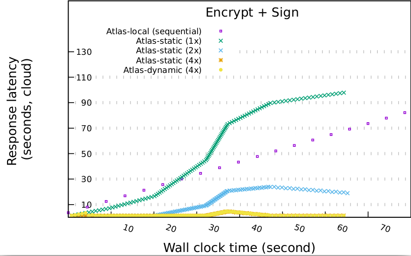

# A Short Atlas Tutorial
Quick jump: [Introduction](#introduction) | [Installation](#installation) | [Repo Structure](#repo-structure) | [Running Scripts](#running-scripts) | [What Next?](#what-next)

This short tutorial covers `atlas`'s main functionality and installation.

## Introduction

Atlas is a system for identifying and offloading bottlenecked/critical JavaScript code with trusted execution in mind.
Atlas is based on two main components:
* **atlas-client**
    The orchistrating component written in JavaScript and is responsible for offloading execution requests. It also includes a modified QuickJS engine enhanced with networking, cryptography and other components
* **atlas-worker**
    Modified QuickJS engine packed with an Intel SGX enclave enhanced with various security attributes
## High level overview of Atlas

Consider the following JavaScript code  
```js
import {lib_a} from './library_a.js';
import {atlas} from './atlas.js';
atlas.wrap(lib_a)
# Bootstrap the servers and setup the communicate channel 
atlas.init()
# start offloading the functions to the cloud 
for (let func in lib_a) 
    atlas.schedule(func, [args]) 
```
`atlas.wrap` calls detect and hooks all the potential code (either functions or objects) from a JavaScript source file.  
The `atlas.init` function prepares and setups the atlas eco-system by doing the following actions:  
 1. Parses `atlas-addesses.txt` (contains all the SGX nodes [Port IP]) and setups sockets
 2. Allocates and creates secure communicate channels (generate a shared encryption key for each remote worker)
 3. Allocates local threads (that communicate with the remote SGX workers)
 4. Pairs the local threads to the remote workers
At this point, we can start offloading requests (by calling the `schedule` function) and then wait for the execution results (run in async)

## Installation

On any Linux distribution, installing and setting up atlas is easy and is split into two sections:  
 1. Install the client code
 2. Install and deploy on the cloud/local with SGX hardware/simulation mode

### Setting up the client environment
```sh
# create the root folder for our project
mkdir atlas_root && cd atlas_root
# fetch the repo of the client
git@github.com:atlas-runtime/atlas-client.git
# fetch the atlas interpreter
git clone git@github.com:atlas-runtime/atlas-qjs.git quickjs
# export the required environment variable
# replace the path to match to your local atlas installation
$ export ATLAS_ROOT=/home/dkarnikis/atlas_root/
# enter the source code folder of QuickJS for the client where $ATLAS_ROOT is the root folder of atlas 
$ cd $ATLAS_ROOT/quickjs/src
# build the client code, it will generate qjs binary 
$ make qjs
# return to the root directory and go to atlas-client 
$ cd $ATLAS_ROOT/atlas-client/
# edit the `atlas-addresses.txt` with your configuration in format `PORT IP`
# in my case my atlas-addresses.txt contains
$ cat $ATLAS_ROOT/atlas-client/atlas-addresses.txt
# 7000 127.0.0.1
# 7001 127.0.0.1
# I may use max two servers, listening to ports 7000 and 7001
```

### Setting up the SGX environment
#### Simulation Mode
(If you want to install with hardware support, skip this step)  
If you want to try atlas **without** using real SGX hardware you do not have to setup the whole SGX infrastructure
```sh
# goto SGX folder of this repo
cd SGX
# execute the binary that setups the SGX SDK
./sgx_linux_x64_sdk_2.14.100.2.bin
# when it asks if you want to install to current directory select `yes` (or choose the directory you want)
# finally a `source` command will appear that you need to execute, in my case:  
source /home/dkarnikis/SGX/sgxsdk/environment
# You are now set to run atlas on simulation mode!
```
#### Hardware Mode
(If you have installed the simulated software, skip this step)  
**SUGGUESTED** Be sure to follow the official Intel guide and install  [Intel SGX SDK](https://github.com/intel/linux-sgx) and [Intel SGX Driver](https://github.com/intel/linux-sgx-driver)  
if you want to use SGX hardware.

### Running atlas-workers with SGX Hardware/Simulation
```sh
# source the your SGX environment, in my case
$ source /home/dkarnikis/SGX/sgxsdk/environment
# fetch the atlas worker
git clone git@github.com:atlas-runtime/atlas-worker.git
# enter the source code folder of the atlas-worker 
$ cd $ATLAS_ROOT/atlas-worker
# build the atlas worker enclave binary
# If you have Intel SGX enabled and running, you may use hardware mode `SGX_MODE=HW`
# If you want to try atlas without the underlying SGX capabilities you may use simulated mode `SGX_MODE=SIM`
$ make SGX_MODE=HW/SIM
```

<!---

### Docker
Atlas on Docker is useful when native installation is not an option -- for example, to allow development on Windows and OS X.  
Note that Atlas on Docker may or may not be able to exploit all available hardware resources.  
There are several options for installing Atlas via Docker.  
The easiest is to `pull` the docker image **TODO**  
```sh
docker pull atlas_docker:v0.1 
```
We refresh this image on every major release.  
(**TODO**: Need to automate this per commit.)  
In case you don't have or don't want to use native SGX support, delete the last two lines from the  
docker-compose.yaml (those that contain devices and /dev/isgx) so that your file may look like this:  
```sh
cat docker-compose.yaml
version: "3.3"                       
services:                            
  sgx:                               
    build:                           
        context: .                   
        dockerfile: docker/Dockerfile
    network_mode: host               
    command: tail -f /dev/null       
    container_name: atlas_docker     
```  
Alternatively, one can built the latest Docker container from scratch by running `docker-compose` in the repo:  
```sh
# build the image
docker-compose up --build -d.
# run the image
docker exec -it atlas_docker /bin/bash
# you will be dropped into a shell in the container, ready to fetch and execute atlas and SGX binaries
# when you want to close the container, you may run (on the same folder as before)
docker-compose down
```
---->
### Building Atlas interpreter
```sh
# go to the directory of the quickjs
$ cd $ATLAS_ROOT/quickjs/src
# It will take some time to build the standalone quickjs interpreter
$ make 
# after this point, the binary is generated and is called qjs and is located at
$ATLAS_ROOT/quickjs/qjs
```

## Running Scripts
All scripts in this guide assume that are being executed from `$ATLAS_ROOT/atlas-client`

### Hash Example

The simplest way to try out atlas is executing remotely `SHA512`, that performs the respective hash function to the input data.  
The file JavaScript file is located at `$ATLAS_ROOT/atlas-client/benchmarks/macro/crypto/streaming.js`  
To run it **locally and sequentially**, you would call it using `--local` flag:  
```sh
$ATLAS_ROOT/quickjs/src/qjs atlas.js --local --file benchmarks/macro/crypto/streaming.js
```
To run it **remotely** and assuming you have two servers and the local client(your main device for offloading): 
```sh
# go to each server and open the atlas-worker application to listen to a port
cd $ATLAS_ROOT/atlas-worker/
# I open my application and listen to port 7000
./app -p 7000
# On my second server, i use port 7001
./app -p 7001
# Back to your main client, alter your atlas-addresses.txt to match the PORT IP 
# address for your two or more devices.
# In my case, I am using localhost as my two server workers (so I am running everything including the workers locally)
$ cat $ATLAS_ROOT/atlas_client/atlas-addresses.txt
# 7000 127.0.0.1
# 7001 127.0.0.1
##################
$ATLAS_ROOT/quickjs/src/qjs atlas.js --threads 2 --servers 2 --file benchmarks/macro/crypto/streaming.js
```
The expected output log should be something similar to this (depending also on your hardware, network and offloading function)  
```sh
$ stdbuf -oL ../quickjs/src/qjs atlas.js --file benchmarks/macro/crypto/streaming.js --threads 2 --servers 2
#Started  Duration  Latency  Bytes   Interval  Return  Mode   Thread_ID  Type  Function
1.001   8.895   8.909   500000  800     9.91    remote  0       exec    SHA512  0
1.802   11.591  11.601  500000  800     13.403  remote  1       exec    SHA512  1
2.603   11.322  18.637  500000  800     21.24   remote  0       exec    SHA512  2
3.404   9.801   19.808  500000  800     23.212  remote  1       exec    SHA512  3
4.206   10.881  27.924  500000  800     32.13   remote  0       exec    SHA512  4
5.007   10.277  28.491  500000  800     33.498  remote  1       exec    SHA512  5
5.808   9.715   36.046  500000  800     41.854  remote  0       exec    SHA512  6
6.609   10.547  37.445  500000  800     44.054  remote  1       exec    SHA512  7
7.41    11.236  45.688  500000  800     53.098  remote  0       exec    SHA512  8
8.211   10.393  46.244  500000  800     54.455  remote  1       exec    SHA512  9
9.012   10.565  54.66   500000  800     63.672  remote  0       exec    SHA512  10
9.813   10.821  55.472  500000  700     65.285  remote  1       exec    SHA512  11
10.513  7.44    60.607  500000  700     71.12   remote  0       exec    SHA512  12
11.915  9.211   68.424  500000  700     80.339  remote  0       exec    SHA512  13
11.214  15.634  69.714  500000  700     80.928  remote  1       exec    SHA512  14
....
```

### Encrypt and Sign

For our second demo application, we will be using a program fragment that performs a simple AES encrypt and sign. Using atlas we should only provide a data buffer (to be encrypted) but also a pair of cryptographic  keys (one used for the encryption and the second for the signing).  
The source code for this JavaScript benchmark is located at `$ATLAS_ROOT/atlas-client/benchmarks/macro/eval/streaming.js`  
To run it **locally and sequentially**, you would call it using `--local` flag:  
```sh
# enter the atlas client
cd $ATLAS_ROOT/atlas-client/
# execute the code
$ATLAS_ROOT/quickjs/src/qjs atlas.js --local --file benchmarks/macro/eval/streaming.js
```
The expected output should be something like this:
```sh
#Started  Duration  Latency  Bytes   Interval  Return  Mode   Thread_ID  Type  Function
0.009     3.635     3.644    500000  1000      3.644   local  -1         exec  encrypt_sign  0
4.646     3.61      8.256    500000  800       8.256   local  -1         exec  encrypt_sign  1
9.057     3.606     12.663   500000  800       12.663  local  -1         exec  encrypt_sign  2
13.464    3.616     17.08    500000  800       17.08   local  -1         exec  encrypt_sign  3
17.881    3.625     21.506   500000  800       21.506  local  -1         exec  encrypt_sign  4
22.307    3.626     25.933   500000  800       25.933  local  -1         exec  encrypt_sign  5
26.734    3.618     30.352   500000  800       30.352  local  -1         exec  encrypt_sign  6
31.153    3.616     34.769   500000  800       34.769  local  -1         exec  encrypt_sign  7
35.57     3.614     39.184   500000  800       39.184  local  -1         exec  encrypt_sign  8
....
```

For the remote offloading, I have already set up 4 remote atlas-workers with native SGX hardware capabilities (You may use the same configuration to use these machines).  
All of the machines are equipped with Intel(R) Core(TM) i7-10710U CPU @ 1.10GHz and 64G RAM.  
I have added their respective addresses in `atlas-addresses.txt` file:
```sh
cat $ATLAS_ROOT/atlas-client/atlas-addresses.txt
##################
7000 128.30.64.131
7000 128.30.64.222
7000 128.30.64.223
7000 128.30.64.227
##################
```
You may use the same configuration for different benchmarks as well.
We may run this benchmark by issuing:

```sh
cd $ATLAS_ROOT/atlas-client
$ATLAS_ROOT/quickjs/src/qjs atlas.js --file benchmarks/macro/eval/streaming.js --threads 4 --servers 4
```

The execution log should similar to this:

```sh
#Started  Duration  Latency  Bytes   Interval  Return  Mode    Thread_ID  Type  Function
1.001     1.525     1.549    500000  800       2.55    remote  0          exec  encrypt_sign  0
1.803     1.501     1.532    500000  800       3.335   remote  1          exec  encrypt_sign  1
2.604     1.544     1.574    500000  800       4.178   remote  2          exec  encrypt_sign  2
3.404     1.517     1.541    500000  800       4.945   remote  3          exec  encrypt_sign  3
4.205     1.519     1.543    500000  800       5.748   remote  0          exec  encrypt_sign  4
5.005     1.51      1.54     500000  800       6.545   remote  1          exec  encrypt_sign  5
5.805     1.535     1.565    500000  800       7.37    remote  2          exec  encrypt_sign  6
6.605     1.507     1.532    500000  800       8.137   remote  3          exec  encrypt_sign  7
....
````

By using different configs (changing the number of threads and servers from 1 to 4), we may get the following plot:  
  
All the avalable execution results for this plot may be found at 
[logs](./logs) directory in the current repo.
## Repo Structure

Atlas consist of four main components and a few additional "auxiliary" files and directories.  
The four main components are:  

* **atlas-client**: The orchestrating component of the eco-system. It is responsible for connecting to the remote `atlas-workers`,  identifying the critical components of a library/module, allocating and generating cryptographic keys, offloading client requests to atlas servers and parsing the execution results.

* **atlas-worker**:  Stripped down-optimized JavaScript interpreter packed inside the SGX enclave. It setups a trusted end-to-end trusted communication channel with the client and then starts handling and executing offloading requests within the enclave. Code that may tamper or compromise enclave\'s confidentiality and integrity is stripped from the interpreter such as system-calls, calls to the untrusted part of the application or signals.  

* **atlas-qjs**: JavaScript Interpreter that runs on the client device. It is an enhanced version of [QuickJS](https://bellard.org/quickjs/quickjs.html) with native networking and cryptographic capabilities and other `atlas` features.

## What next?
* Configurable Scheduler and rules
* Android Port
* Battery Performance Logging
* IoT deployment
